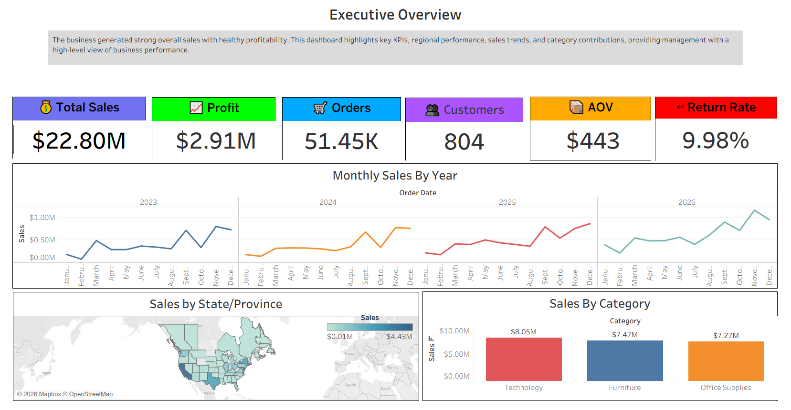
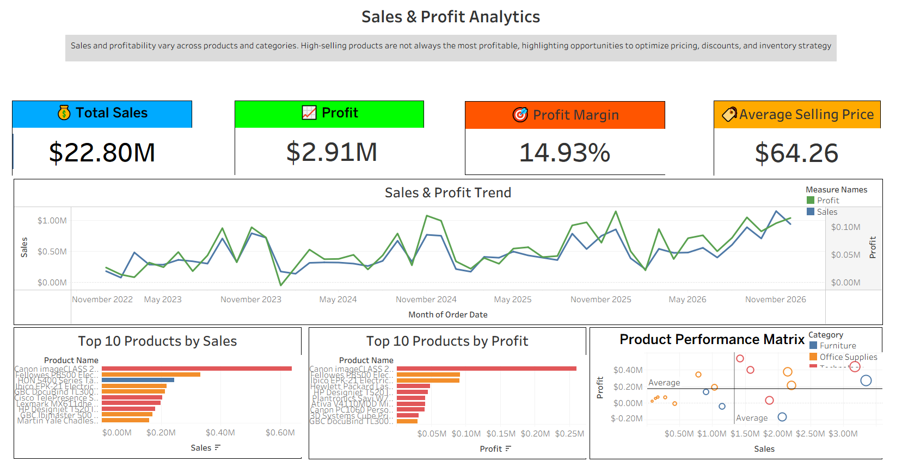
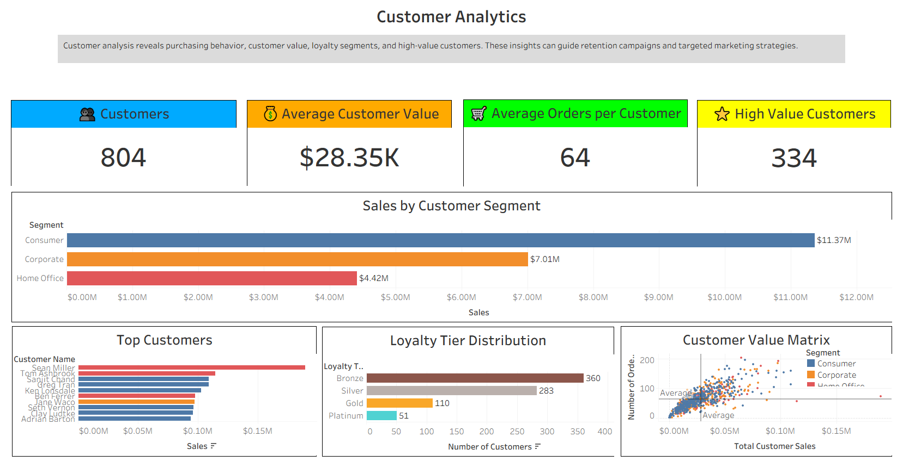
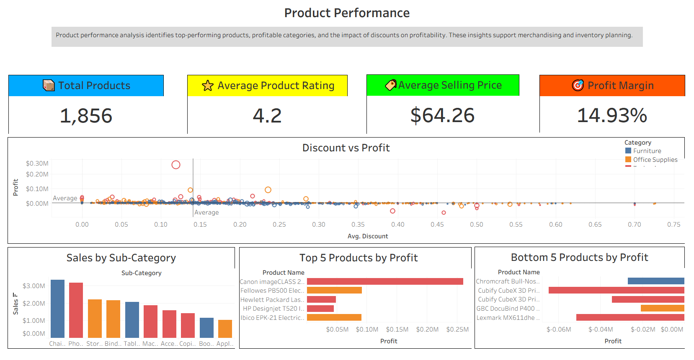

# 📊 Retail Sales & Customer Analytics Platform

An end-to-end Business Intelligence project that transforms raw retail sales data into actionable business insights using **Python**, **Alteryx**, and **Tableau**.

This project demonstrates the complete analytics pipeline—from data preparation and feature engineering to interactive dashboards and business recommendations.

---

## 🚀 Project Overview

Businesses generate massive amounts of sales data every day. However, raw data alone provides limited value.

This project builds a complete analytics solution that:

- Expands and enriches retail sales data
- Performs ETL and feature engineering
- Creates business-focused KPIs
- Develops interactive dashboards
- Generates strategic recommendations for decision-makers

---

## 🛠️ Tech Stack

| Technology | Purpose |
|------------|----------|
| Python | Data expansion & enrichment |
| Pandas | Data preprocessing |
| NumPy | Synthetic data generation |
| Alteryx Designer | ETL workflow & feature engineering |
| Tableau Desktop | Dashboard development |
| Tableau Public | Dashboard publishing |

---

# 📁 Project Structure

```
Retail-Sales-Customer-Analytics/
│
├── Datasets/
│   ├── Original/
│   └── Processed/
│
├── Python/
│   ├── Expand_Superstore_Dataset.py
│   ├── Generate_Shipping_Cost.py
│   ├── Generate_Delivery_Days.py
│   └── Generate_Returns.py
│
├── Alteryx/
│   └── Retail_ETL_Workflow.yxmd
│
├── Tableau/
│   └── Retail_Sales_Customer_Analytics.twbx
│
├── Screenshots/
│
└── README.md
```

---

# ⚙️ Project Workflow

```
Original Superstore Dataset
            │
            ▼
Dataset Expansion (Python)
            │
            ▼
Shipping Cost Generation
            │
            ▼
Delivery Days Generation
            │
            ▼
Returns Dataset Generation
            │
            ▼
Alteryx ETL Pipeline
            │
            ▼
Feature Engineering
            │
            ▼
Interactive Tableau Dashboards
            │
            ▼
Business Insights & Recommendations
```

---

# 📊 Dashboard Overview

## 1️⃣ Executive Overview

Provides a high-level summary of business performance.

Features:

- Total Sales
- Total Profit
- Orders
- Customers
- Average Order Value
- Return Rate
- Monthly Sales Trend
- Regional Sales
- Category Performance
- Geographic Sales Distribution

---

## 2️⃣ Sales & Profit Analysis

Analyzes profitability across different dimensions.

Includes:

- Sales Trend
- Profit Trend
- Profit Margin
- Top Products
- Bottom Products
- Sales vs Profit Scatter Plot
- Average Selling Price

---

## 3️⃣ Customer Analysis

Provides customer segmentation and purchasing behavior.

Features:

- Customer Count
- Customer Segments
- High Value Customers
- Customer Value Matrix
- Loyalty Distribution
- Top Customers

---

## 4️⃣ Product Performance

Evaluates product and category performance.

Includes:

- Top Performing Products
- Bottom Performing Products
- Sales by Category
- Sales by Sub-Category
- Discount vs Profit Analysis

---

## 5️⃣ Returns & Shipping Analytics

Analyzes operational performance.

Features:

- Return Rate
- Return Reasons
- Courier Performance
- Shipping Cost
- Return Rate by Region
- Return Rate by Ship Mode

---

# 🧠 Feature Engineering

The following business metrics were created during the ETL process:

- Profit Margin
- Average Selling Price
- Delivery Performance
- Net Profit
- High Value Order
- Return Flag
- Order Year
- Order Month
- Order Quarter
- Discount Category
- Profit Category
- Profit Band

---

# 🐍 Python Modules

## Expand_Superstore_Dataset.py

Expands the original Superstore dataset to approximately **100,000 records** for large-scale analytics.

---

## Generate_Shipping_Cost.py

Generates realistic shipping costs using:

- Sales Amount
- Ship Mode
- Region

---

## Generate_Delivery_Days.py

Assigns:

- Courier Partner
- Delivery Days
- Ship Date

using realistic delivery ranges.

---

## Generate_Returns.py

Creates a realistic Returns dataset including:

- Returned Orders
- Return Reasons

---

# 🔄 Alteryx Workflow

The Alteryx workflow performs:

- Data Cleaning
- Joins
- Data Validation
- Feature Engineering
- Formula Calculations
- Data Preparation
- Output Generation

---

# 📈 Key Business Insights

Some insights generated from the dashboards include:

- Regional sales performance
- Most profitable product categories
- Customer purchasing behavior
- High-value customer identification
- Shipping efficiency analysis
- Product return patterns
- Profitability trends
- Discount effectiveness

---

# 💡 Business Recommendations

The dashboards help businesses:

- Improve profitability
- Reduce product returns
- Optimize shipping performance
- Increase customer retention
- Identify high-performing products
- Improve inventory planning
- Support data-driven decision making

---

# 📷 Dashboard Screenshots

## Executive Overview



---

## Sales & Profit Analysis



---

## Customer Analysis



---

## Product Performance



---

## Returns & Shipping Analytics


---

# 🌐 Interactive Dashboard

🔗 **Tableau Public**

Add your Tableau Public link here:

[https://public.tableau.com/views/YourDashboard](https://public.tableau.com/app/profile/ansh.agraekar/viz/Retail_Sales_Customer_Analytics/ProjectOverview)

---

# 🚀 Future Improvements

Potential enhancements include:

- SQL Database Integration
- Real-Time Dashboard Updates
- Customer Churn Prediction
- Sales Forecasting using Machine Learning
- Demand Forecasting
- Inventory Optimization
- Automated ETL Scheduling

---

# 📌 Skills Demonstrated

- Data Analytics
- Business Intelligence
- ETL Development
- Data Visualization
- Feature Engineering
- Dashboard Design
- Python Programming
- Alteryx Designer
- Tableau
- KPI Development

---

# 👤 Author

**Ansh Agraekar**

AI / ML Engineer | Data Analyst

GitHub: https://github.com/YourUsername

LinkedIn: https://linkedin.com/in/YourProfile
